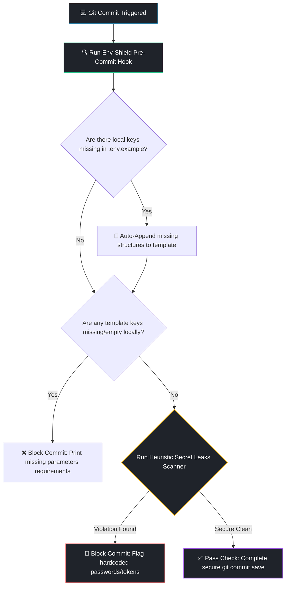

# 🛡️ Env-Shield

    

Give your workspace absolute infrastructure superpowers. **Env-Shield** is a smart, zero-config environment validation engine and native Git `pre-commit` hook that completely eliminates the *"it broke on my machine because someone forgot to share a new `.env` key"* headache, while strictly guarding your repositories against dangerous production credential leaks.

---

## ⚡ Quick Start (Protect Your Repo in 5 Seconds)

### 1. Add Tooling to Your Project
Download the core engine and the automation installer directly into your repository's root directory:

```bash
curl -fsSL https://githubusercontent.com -o env_shield.js
curl -fsSL https://githubusercontent.com -o install.sh
```

### 2. Activate Native Git Security Hooks
Run the automated shell bundle installer to hook the validator engine natively into your local source control lifecycle:

```bash
bash install.sh
```

---

## 📐 Pipeline Automation Architecture

Env-Shield runs completely locally and intercepts your staging commits sequence transparently inside milliseconds.



---

## 💎 Superpowers Included

### 🧠 Auto-Synchronizing Blueprinting Engine
Whenever you add a new environment variable to your local hidden `.env` file, Env-Shield automatically catches it and appends the structural key straight to your shared `.env.example` file. No manual copy-pasting ever again.

### 🛑 Empty Boundary Check Blockers
If a teammate pulls your repository changes and attempts to run or commit changes while lacking a new crucial configuration property declared inside `.env.example`, the hook blocks the commit and cleanly visualizes exactly what key is missing locally.

### 🔍 Heuristic Anti-Leak Cryptography Shield
Env-Shield evaluates active structural variable strings using advanced regex algorithms to prevent catastrophic accidental hardcoded credential pushing leaks. It intercepts and blocks commits if it detects:
* Raw unencrypted **AWS Access/Secret Signature Tokens**.
* Hardcoded generic weak production root authentication strings (e.g. `admin`, `root`, `password`).
* Raw plain-text signatures matching **JSON Web Tokens (JWT)** payloads.
* Structural boundaries matching unescaped **SSH Private Keys**.

---

## 🛠️ Testing Verification Locally

You can evaluate your workspace states on demand without running code commits steps by querying the engine directly using Node:

```bash
node env_shield.js
```

---

## 🤝 Contributing

We love secure open-source contributions! Want to expand our regex matrix to support GitHub tokens, Google Cloud API signatures, or stripe webhooks secrets heuristics keys detection? 

1. Fork this Repository
2. Add your custom patterns inside `SECRET_PATTERNS` mapping structures in `env_shield.js`
3. Commit optimizations safely (`git commit -m 'Add Stripe API pattern scanner'`)
4. Push upstream (`git push origin feature/AmazingPattern`)
5. Open a structured Pull Request

## 📝 License

Distributed under the MIT License. See `LICENSE` for more architectural compliance information.
